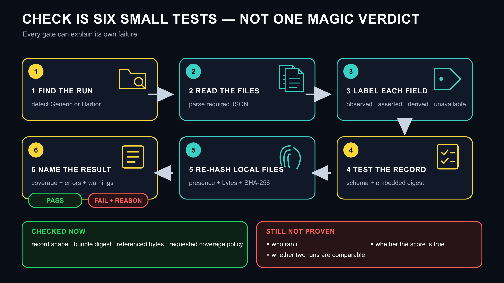

# Eval Evidence

**A post-run evidence envelope and integrity checker for AI evaluations.**

> A score should travel with a machine-checkable record of what was observed,
> asserted, derived, and unavailable.

**Development status:** narrow mapping-review candidate; real-Harbor gate G2 is
unmet; version 0.2.0 is not on PyPI. Start with the [handoff router](docs/START_HERE.md)
or inspect the same state in [`PROJECT_HANDOFF.json`](PROJECT_HANDOFF.json). Pin an
exact commit rather than treating mutable `main` as a release.

<picture>
  <source media="(max-width: 600px)" srcset="figures/eval-evidence-lifecycle-mobile.png">
  
</picture>

The [static lifecycle figure](figures/README.md) is generated offline from a frozen,
machine-readable brief. It describes review states, not model quality or a universal
trust score.

Eval Evidence produces a deterministic JSON bundle that carries three kinds of evidence
without pretending to adjudicate them:

<picture>
  <source media="(max-width: 600px)" srcset="figures/eval-evidence-envelope-anatomy-mobile.png">
  
</picture>

This is what “build a bundle” means in concrete terms. The adapter reads retained run
files, labels where values came from, records missing fields as `unavailable`, and adds
file fingerprints. It does not copy a whole run or turn a reported value into truth.

1. **Item validity:** record supplied validity claims—or state that none were supplied.
2. **Evaluation instrument:** record model, agent, harness, budgets, and other fields
   with explicit provenance and coverage.
3. **Verifier evidence:** keep reported rewards separate from reward-independent
   evidence.

It works offline, runs no models, uploads nothing, and treats missing evidence as
`unavailable` rather than guessing. It checks bundle and referenced-file identity; it
cannot decide whether a task is broken, a verifier is correct, or one model is better.

## Five-minute quickstart

Python 3.11–3.14:

```bash
python -m pip install "eval-evidence @ git+https://github.com/edward-lcl/eval-evidence@main"
eval-evidence demo -o /tmp/eval-run
eval-evidence check /tmp/eval-run
eval-evidence bundle /tmp/eval-run -o /tmp/eval-evidence.json
eval-evidence verify /tmp/eval-evidence.json --run-root /tmp/eval-run
```

<picture>
  <source media="(max-width: 600px)" srcset="figures/eval-evidence-command-path-mobile.png">
  
</picture>

The [command switchboard brief and editable SVG](figures/README.md) keep each command's
output beside its proof boundary. It is an index into the story, not the whole story:

<picture>
  <source media="(max-width: 600px)" srcset="figures/eval-evidence-check-story-mobile.png">
  
</picture>

The diagram is a teaching layer; the command help and JSON output remain authoritative
for automation.

The demo is deterministic and synthetic. `check` is the one-command path: it detects
the input adapter, builds a bundle in memory, validates the schema and digest, re-hashes
local references, and reports evidence coverage. An optional
`check --min-coverage VALUE` heuristic can reject records below an operator-chosen
completeness fraction. Coverage shortfalls appear under `policy_errors`; they return
exit 1 without mislabeling schema, digest, or reference integrity as invalid. No default
threshold is recommended: any fraction can still omit model-response, harness,
environment, or verifier identity. This is not a comparability or claim-readiness score;
critical-field policy profiles are future work.

## Use it before, after, or on prior runs

| When | How Eval Evidence fits |
|---|---|
| Before a new run | Configure the existing harness to retain model-response identity, instrument settings, task/environment/verifier digests, and source artifacts. v0.2 does not yet provide a preflight or live monitor. |
| After a run | Run `check`, seal a bundle, store it separately, and verify it against the stable run root. |
| On historical runs | Reprocess retained Harbor trials directly, or add an honestly sourced generic manifest to a preserved copy. No model rerun is required. Missing historical evidence remains `unavailable`. |
| When publishing | Compare recorded conditions and disclose integrity failures, material differences, unknowns, denominators, and exclusions. Campaign packages and generated comparison reports are future work. |

A retrospective bundle establishes archive identity from the time it is created; it
cannot prove the archive was unchanged since the original evaluation without an older
trusted baseline. See the [product lifecycle](docs/LIFECYCLE.md) for prospective setup,
retrospective import, and the role of static graphics.

## Works with any evaluation stack

### Generic manifest

Add one `eval-run.json` next to your run outputs:

```json
{
  "schema_version": "eval-evidence.run/v0.1",
  "run": {"id": "run-42", "task_id": "task-7", "task_revision": "abc123"},
  "instrument": {
    "model_id": "provider/model",
    "harness_name": "my-evaluator",
    "harness_version": "2.4.0",
    "max_turns": 20
  },
  "metrics": {"input_tokens": 1200, "output_tokens": 300},
  "outcome": {"reward": 1, "scores": {"tests": 1}, "termination_reason": "completed"},
  "references": [
    {"path": "results.json", "role": "score-output"},
    {"path": "logs/events.json", "role": "execution-log", "required": false}
  ]
}
```

Then run:

```bash
eval-evidence check /path/to/run
eval-evidence bundle /path/to/run -o evidence.json
```

For manually assembled manifests, values without `provenance` default to
`operator_asserted`, never `observed`. Add explicit entries for observed, derived, or
provider-asserted values. See the [owner walkthrough](docs/OWNER_WALKTHROUGH.md) for a
complete application example and a paired-result investigation.

### Harbor

Harbor trial directories are detected directly from `result.json`, `config.json`, and
`agent/trajectory.json`:

```bash
eval-evidence check /path/to/harbor-job
eval-evidence bundle /path/to/harbor-job -o evidence/
```

Harbor is the first adapter, not the canonical format. This complements `harbor view`:
the viewer explores jobs and compares results, while Eval Evidence creates portable
per-trial evidence envelopes for offline integrity and provenance checks. Version 0.2
does not create a job-level denominator/index manifest or decide whether trials are
comparable.

Terminal-Bench and Harbor maintainers should start with the focused
[`review brief`](docs/TBENCH_REVIEW.md), then red-line the reviewable
[`Harbor field mapping`](docs/HARBOR_MAPPING.md). The
[`adapter guide`](docs/ADAPTERS.md) covers other evaluators.

## One entry point per audience

| Audience | Start here | Benefit |
|---|---|---|
| New teammate | [`docs/START_HERE.md`](docs/START_HERE.md) | Identify authority, a safe next task, its owner, and completion evidence without oral context |
| Developer | [`docs/ARCHITECTURE.md`](docs/ARCHITECTURE.md) | Find the adapter/core boundary, wire contracts, tests, and review surface |
| Repository owner | [`docs/MAINTAINER_HANDOFF.md`](docs/MAINTAINER_HANDOFF.md) | Resolve owner-only gates and release decisions without confusing them with technical readiness |
| Terminal-Bench / Harbor maintainer | [`docs/TBENCH_REVIEW.md`](docs/TBENCH_REVIEW.md) | Red-line the mapping and choose the real-fixture and denominator routes |
| Paper author or reviewer | [`docs/PAPER_ALIGNMENT.md`](docs/PAPER_ALIGNMENT.md) | Separate shipped evidence support from the paper's empirical authority |
| Agent | [`AGENTS.md`](AGENTS.md) and [`PROJECT_HANDOFF.json`](PROJECT_HANDOFF.json) | Select bounded, dependency-ready work and return reproducible receipts |
| Security reviewer | [`SECURITY.md`](SECURITY.md) and [`docs/TRUST_MODEL.md`](docs/TRUST_MODEL.md) | Test the declared trust boundary with synthetic inputs |

## Check-only GitHub Action

Protected `main` is the development authority for the 0.2.0 candidate. For reproducible
or production use, replace the mutable branch with a reviewed commit SHA or `v0.2.0`
after that tag exists:

```yaml
- uses: edward-lcl/eval-evidence@main
  with:
    run-path: evaluation-runs
    adapter: auto
```

The pre-release `main` reference is intentionally easy to try but remains mutable.
Historical pull requests record how the candidate evolved; they are not installation
authorities. Record the exact installed SHA for reproduction, and pin an accepted
commit or release tag before relying on it in production. The older `v0.1.0` tag does
not provide `--min-coverage`, `inspect
--explain`, or Harbor schema compatibility warnings.

The Action runs `check` in memory. It does not write or upload a baseline bundle, so it
cannot by itself detect a later mutation. Stage downloaded Harbor artifacts inside the
checkout before invoking it: `run-path` must remain repository-relative. Absolute
paths, `..`, and resolved escapes are rejected. The Action also accepts optional
`max-runs` and `min-coverage` inputs.

## Exit codes and verification boundary

| Exit | Meaning |
|---|---|
| `0` | Command completed and all requested checks passed. |
| `1` | Checks completed, but a run/bundle was invalid, a reference differed, or a requested coverage threshold was missed. |
| `2` | Usage, discovery, unsafe-path, malformed-input, or output precondition error prevented the requested check. |

`verify BUNDLE` without `--run-root` checks the JSON schema and whether the bundle's
claims match its embedded digest. It does **not** re-hash source files. Add
`--run-root PATH` to compare referenced files with local bytes. Neither mode proves who
created the bundle: anyone who edits an unsigned bundle can recompute its digest.

<picture>
  <source media="(max-width: 600px)" srcset="figures/eval-evidence-tamper-story-mobile.png">
  
</picture>

## What a bundle does not prove

- A SHA-256 digest identifies bytes; it is not a trusted-runner signature.
- A reported reward is not ground truth.
- A signature can authenticate a signer and scoped claims; it cannot make claims true.
- Provider-side policy, prompt assembly, or effective network enforcement remain
  unavailable unless the run records them.
- Eval Evidence hashes referenced files rather than copying their contents. The Harbor
  adapter does not copy prompts, trajectories, tool paths/URLs, credentials, or
  environment variables; it does carry selected identifiers and configured values.
  Generic manifest values and extensions are user-supplied and are embedded, so review
  every bundle before sharing it.
- This tool is not a leaderboard, model runner, certification authority, hosted
  registry, or physical-verification system.

The v0.1 bundle contract intentionally emits `attestation.signature: null`. The trust model in
[`docs/TRUST_MODEL.md`](docs/TRUST_MODEL.md) describes the gate before signing or a
physical verifier is added.

## Contracts and identity

The distribution includes four contracts/crosswalks under `eval_evidence/schemas/`:

- generic run manifest: `eval-evidence.run/v0.1`;
- evidence bundle: `eval-evidence.bundle/v0.1`;
- instrument manifest: `eval-evidence.instrument/v0.1`;
- informative OpenTelemetry GenAI crosswalk.

A schema's HTTPS `$id` identifies its published document. The `schema_version` string
inside a run or bundle is the wire contract. The package/CLI name is `eval-evidence`,
and the Python import is `eval_evidence`; these are deliberately distinct layers.

## Development

```bash
python -m pip install -e '.[test]'
python -m unittest discover -s tests -v
python -m build --wheel --sdist --outdir dist
python scripts/audit_distribution.py dist
```

See the [handoff router](docs/START_HERE.md), [architecture map](docs/ARCHITECTURE.md),
[readiness gates](docs/READINESS.md),
[product lifecycle](docs/LIFECYCLE.md),
[owner walkthrough](docs/OWNER_WALKTHROUGH.md),
[Terminal-Bench review brief](docs/TBENCH_REVIEW.md),
[bundle specification](docs/BUNDLE_SPEC.md), [adapter guide](docs/ADAPTERS.md),
[compatibility policy](docs/COMPATIBILITY.md), [trust model](docs/TRUST_MODEL.md),
and [security policy](SECURITY.md).

## License

Apache-2.0. `NOTICE` describes the exact release boundary. No benchmark corpus,
trajectory archive, manuscript, or third-party source tree is included.
